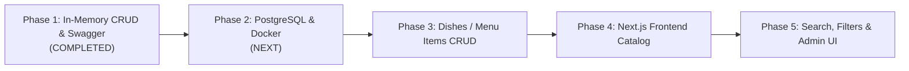

# 📋 Food App - Implementation Plan & Progress Tracking

This document outlines the architectural roadmap, milestones achieved so far, and upcoming development phases for the **Food App** project.

---

## 📌 Project Overview

**Food App** is a full-stack web application designed for exploring restaurants, browsing menus/dishes, and tracking prices. It follows clean architecture, strict TypeScript typing, and modular layered design across backend and frontend services.

---

## ✅ Completed Milestones (What We Have Made So Far)

### 1. Project Foundation & Dual-Workspace Structure
- [x] Initialized dual-workspace layout:
  - `backend/`: Express.js 5 with TypeScript (`tsx` runner), running on port `5000`.
  - `frontend/`: Next.js 16 (App Router), React 19, Tailwind CSS v4, running on port `3000`.
- [x] CORS configuration configured to allow requests from the frontend client.
- [x] Environment configuration (`.env` and `.env.example`) with type-safe schema checks.
- [x] Git repository configured, synced, and tracking `kittypawgrammer/food_app.git`.

### 2. Centralized Error Handling & Architecture Setup
- [x] **Layered Separation**:
  - `routes/`: Endpoint paths and HTTP method bindings.
  - `controllers/`: Request body extraction, validation, and HTTP response dispatch.
  - `models/`: Data persistence and querying layer.
  - `middlewares/`: Global 404 (`notFound.ts`) and central error handling (`errorHandler.ts`).
  - `types/`: Shared domain interfaces and DTOs.
- [x] Custom `AppError` utility class for HTTP status codes (`400`, `404`, `500`).

### 3. Full Restaurant CRUD Operations
- [x] **Data Types & DTOs** (`src/types/restaurant.ts`):
  - `Restaurant` entity interface.
  - `CreateRestaurantDto` and `UpdateRestaurantDto` for mutation payloads.
- [x] **Model Layer** (`src/models/restaurant.model.ts`):
  - Modular in-memory store supporting `findAll`, `findById`, `create`, `update`, and `delete`.
  - Built-in multi-criteria filtering: `cuisine`, keyword `search`, and `minRating`.
- [x] **Controller Handlers** (`src/controllers/restaurant.controller.ts`):
  - Input validation (non-empty strings, rating bounds `0.0`–`5.0`, numeric ID checks).
  - Appropriate HTTP status codes (`200 OK`, `201 Created`, `400 Bad Request`, `404 Not Found`).
- [x] **Route Registration** (`src/routes/restaurant.routes.ts`):
  - `GET /api/restaurants` — List all restaurants (supports query filters).
  - `GET /api/restaurants/:id` — Get single restaurant by ID.
  - `POST /api/restaurants` — Create a new restaurant.
  - `PUT /api/restaurants/:id` — Update existing restaurant.
  - `DELETE /api/restaurants/:id` — Remove restaurant.

### 4. Interactive Swagger / OpenAPI 3.0 Documentation
- [x] Integrated `swagger-ui-express` with full OpenAPI 3.0 specification (`src/config/swagger.ts`).
- [x] Complete schema definitions for models, DTOs, and error payloads.
- [x] Endpoints mounted:
  - Interactive Swagger UI: `http://localhost:5000/api/docs` and `http://localhost:5000/docs`
  - Raw JSON Schema: `http://localhost:5000/api/docs.json`

---

## 🗺️ Upcoming Roadmap & Next Steps

### 🔲 Phase 2: Docker & PostgreSQL Integration (Next Immediate Step)
1. **Container Setup**:
   - Create root `docker-compose.yml` defining PostgreSQL 16 container and persistent volume.
2. **Database Driver & Pooling**:
   - Install `pg` and `@types/pg` (or ORM/query builder like Prisma or Drizzle, as preferred).
   - Configure connection pool in `src/config/db.ts`.
3. **Database Schema & Migrations**:
   - Create `restaurants` SQL table schema.
   - Replace in-memory logic in `src/models/restaurant.model.ts` with parameterized SQL queries.

### 🔲 Phase 3: Relational Dishes / Menu Management
1. **Schema Design**:
   - Create `dishes` table with foreign key `restaurant_id` referencing `restaurants(id)`.
   - Fields: `name`, `description`, `price`, `category`, `imageUrl`, `isAvailable`.
2. **Dishes CRUD API**:
   - `GET /api/restaurants/:restaurantId/dishes`
   - `POST /api/restaurants/:restaurantId/dishes`
   - `PUT /api/dishes/:id`
   - `DELETE /api/dishes/:id`
3. **Swagger Docs Update**:
   - Add Dish schemas and nested endpoints to Swagger specification.

### 🔲 Phase 4: Next.js Frontend Catalog
1. **Data Fetching with RSC**:
   - Fetch restaurants server-side in Next.js Server Components.
2. **UI Components**:
   - Restaurant card with cuisine badge, rating star indicators, and cover images.
   - Menu list view showing dish cards with prominent pricing.
3. **Responsive Design**:
   - Mobile and desktop grid layouts using Tailwind CSS.

### 🔲 Phase 5: Search, Filtering & Mutations
1. **Client Features**:
   - Live search bar and cuisine category chips.
   - Modal/form for adding and editing restaurants and dishes.
2. **Optimistic Updates & Feedback**:
   - Toast notifications for successful creations/updates.

### 🔲 Phase 6: Production Hardening
- [ ] Add `helmet` for security headers.
- [ ] Add `express-rate-limit` for DDoS / brute-force protection.
- [ ] Automated integration tests for API endpoints.
